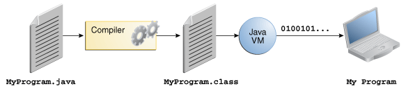
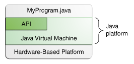

# Introduction

**Java**: A simple, portable, object oriented  and secure language
Java programs are written in a file with the extension .java. Steps involved in running a Java program are:

**The compiler**: javac is the compiler which converts java code into a code which the jvm (java virtual machine) can understand. This new code(called bytecode) is stored in a .class file. 
The .class file is read by the jre ie. java runtime (java command) and output is produced.

**Java Platform**: Hardware or software environment in which java program runs.
Java platform has two components:

**Java Application Programming Interface:** Large collection of ready-made software components, grouped into libraries of related classes and interfaces. These libraries are called “packages”. A simple illustration of the process followed:

