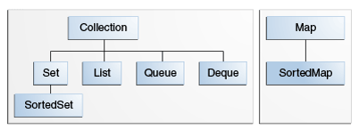

# Collections


Collection is a object which groups multiple elements in a single unit. Collections are used to store, retrieve, manipulate, and communicate aggregate data. Eg. Telephone directory is a collection, which maps names to telephone numbers.

Collections framework is a unified architecture for representing and manipulating
collections. All collection frameworks contain the following:
1. Interfaces: Abstract data types that represent collections
2. Implementations: Concrete implementation of the interfaces, contain data structures.
3. Algorithms: methods that perform useful computation on objects that implement the collection interfaces. eg. Search, sort etc.

The Java Collections Framework provides the following benefits:

* **Reduces programming effort:** By providing useful data structures and algorithms, the Collections Framework frees you to concentrate on the important parts of your program rather than on the low-level "plumbing" required to make it work. 
* **Increases program speed and quality:** This Collections Framework provides high-performance, high-quality implementations of useful data structures and algorithms. The various implementations of each interface are interchangeable, so programs can be easily tuned by switching collection implementations. 
 
* **Allows interoperability among unrelated APIs:** The collection interfaces are the vernacular by which APIs pass collections back and forth. If my network administration API furnishes a collection of node names and if your GUI toolkit expects a collection of column headings, our APIs will interoperate seamlessly, even though they were written independently. 
* **Reduces effort to learn and to use new APIs:** Many APIs naturally take collections on input and furnish them as output.
* **Reduces effort to design new APIs:** This is the flip side of the previous advantage. Designers and implementers don't have to reinvent the wheel each time they create an API that relies on collections; instead, they can use standard collection interfaces. 
* **Fosters software reuse:** New data structures that conform to the standard collection interfaces are by nature reusable. The same goes for new algorithms that operate on objects that implement these interfaces. 

##Core Collection Interfaces

The core collection interfaces encapsulate different types of collections, which are shown in the figure below. These interfaces allow collections to be manipulated independently of the details of their representation. Core collection interfaces are the foundation of the Java Collections Framework. As you can see in the following figure, the core collection interfaces form a hierarchy.



The Collection interface is used to pass around collections of objects where maximum generality is desired.A collection can be converted to an array using the toArray() method. 

**Collections can hold only reference types. So ```List<int>``` etc. is not allowed, use ```List<Integer>``` instead**
## The core collection interfaces:

* **Collection**: the root of the collection hierarchy. A collection represents a group of objects known as its elements. The Collection interface is the least common denominator that all collections implement and is used to pass collections around and to manipulate them when maximum generality is desired.
* **Set: **a collection that cannot contain duplicate elements. This interface models the mathematical set abstraction and is used to represent sets, such as the cards comprising a poker hand, the courses making up a student's schedule, or the processes running on a machine.
* **List: **an ordered collection (sometimes called a sequence). Lists can contain duplicate elements. The user of a List generally has precise control over where in the list each element is inserted and can access elements by their integer index (position). If you've used Vector, you're familiar with the general flavor of List.
* **Queue: **a collection used to hold multiple elements prior to processing. Besides basic Collection operations, a Queue provides additional insertion, extraction, and inspection operations. Queues typically, but do not necessarily, order elements in a FIFO (first-in, first-out) manner. Among the exceptions are priority queues, which order elements according to a supplied comparator or the elements' natural ordering.
* **Deque: ** a collection used to hold multiple elements prior to processing. Besides basic Collection operations, a Deque provides additional insertion, extraction, and inspection operations. Deques can be used both as FIFO (first-in, first-out) and LIFO (last-in, first-out). In a deque all new elements can be inserted, retrieved and removed at both ends. 
* **Map: ** an object that maps keys to values. A Map cannot contain duplicate keys; each key can map to at most one value.

The last two core collection interfaces are merely sorted versions of Set and Map:

* **SortedSet: **  a Set that maintains its elements in ascending order. Several additional operations are provided to take advantage of the ordering. Sorted sets are used for naturally ordered sets, such as word lists and membership rolls. 
* **SortedMap: **  a Map that maintains its mappings in ascending key order. This is the Map analog of SortedSet. Sorted maps are used for naturally ordered collections of key/value pairs, such as dictionaries and telephone directories. 

##General purpose implementations:
###Set implementations:
There are three general-purpose Set implementations :

* **HashSet:** Faster than TreeSet, no ordering guarantees
* **TreeSet:** Implements SortedSet interface, value ordering possible.
* **LinkedHashSet:**Implemented as a hash table with a linked list running through it, it provides insertion-ordered iteration (least recently inserted to most recently) and runs nearly as fast as HashSet.

The standard way to create a Set:
```
Set<String> s = new HashSet<>()
```
Set interface basic operations:
* The ```size``` operation returns the number of elements in the Set (its cardinality). 
* The ```isEmpty``` method does exactly what you think it would. 
* The``` add``` method adds the specified element to the Set if it is not already present and returns a boolean indicating whether the element was added.
* the``` remove``` method removes the specified element from the Set if it is present and returns a boolean indicating whether the element was present. 
* The ```iterator``` method returns an Iterator over the Set.

A simple example to print duplicate words:
```
import java.util.*;

public class FindDups {
    public static void main(String[] args) {
        Set<String> s = new HashSet<String>();
        for (String a : args)
               s.add(a);
               System.out.println(s.size() + " distinct words: " + s);
    }
}
```
### List implementations
 In addition to the operations inherited from Collection, the List interface includes operations for the following:

* Positional access — manipulates elements based on their numerical position in the list. This includes methods such as``` get, set, add, addAll, remove```.

* Search — searches for a specified object in the list and returns its numerical position. Search methods include ```indexOf``` and ```lastIndexOf.```

* Iteration — extends Iterator semantics to take advantage of the list's sequential nature. The ```listIterator``` methods provide this behavior.

* Range-view — The ```sublist``` method performs arbitrary range operations on the list.

There are two general-purpose List implementations : ```ArrayList``` and ```LinkedList```

**ArrayList: **offers constant-time positional access and is just plain fast. 

**LinkedList: **If you frequently add elements to the beginning of the List or iterate over the List to delete elements from its interior, you should consider using LinkedList. These operations require constant-time in a LinkedList and linear-time in an ArrayList. Also implements the ```Queue``` interface.

Standard way of creating LinkedList/ArrayList instance:
```
List<String> words = new LinkedList<>();
List<String> words = new ArrayList<>();
```
Here is a program to read words from the command line and shuffle them,
```
import java.util.*;

public class Shuffle {
    public static void main(String[] args) {
        List<String> list = Arrays.asList(args);//args contains command line arguments
        Collections.shuffle(list);
        System.out.println(list);
    }
}
```
The Collections class has many methods which can be applied on a list. In the previous example, we used the shuffle() method.

###Map implementations

