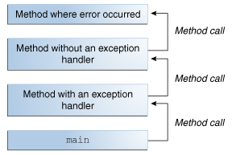
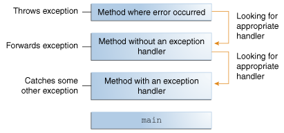

# Exceptions
An exception is an event, which occurs during the execution of a program, that disrupts the normal flow of the program's instructions. 

When an error occurs in a method following steps happen:

1. The method creates an object and hands it off to the runtime system.

2.  This process is called throwing an exception, and the object is called exception object.
Exception object contains: 
information about the error, including its type 
the state of the program when the error occurred

3. After a method throws an exception, the runtime system attempts to find something to handle it. The set of possible "somethings" to handle the exception is the ordered list of methods that had been called to get to the method where the error occurred. The list of methods is known as the call stack.

4)  The runtime system searches the call stack for a method that contains a block of code that can handle the exception. This block of code is called an exception handler.

5) The exception handler chosen is said to catch the exception. If the runtime system exhaustively searches all the methods on the call stack without finding an appropriate exception handler, as shown in the above figure, the runtime system (and, consequently, the program) terminates.
